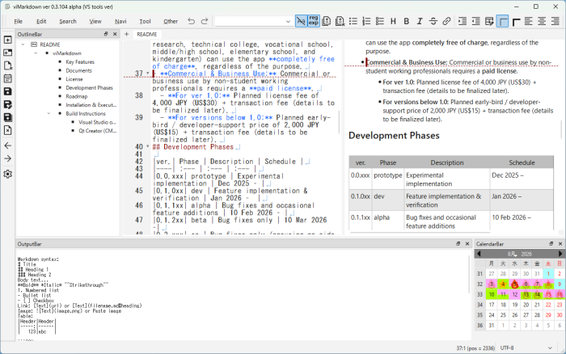

# viMarkdown

-- visual Markdown editor --

[日本語版 (Japanese)](README_ja.md)

**viMarkdown** is a lightweight, high-performance Markdown editor built with **Qt6** and **C++**.  
It is designed for developers and writers who love efficiency.

<!---->

## Key Features
- **Real-time Editor-Preview Synchronization**
  The cursor position and edits are synchronized in real time. This allows for intuitive editing while fully preserving the structural integrity of your Markdown.
- **Direct Editing in the Preview**
  Allows inserting and deleting text directly within the preview pane, not just the editor. You can complete your editing tasks in a true WYSIWYG (What You See Is What You Get) manner.
- **Vi Keybindings (Vi Commands) Support**
  Supports vi commands, enabling fast text editing and cursor navigation without ever having to move your hands from the home row.
- **Powerful Grep (Global Search) Functionality**
  Instantly extract target text across multiple files or entire directories, strongly supporting efficient document search and bulk editing.
- **Outline-based Navigation**
  Easily keep track of the overall document flow and quickly jump to target sections, even in long-form writing. This supports highly efficient editing aligned with the document structure.
- **Custom Blocks & SVG Rendering Support**
  In addition to text-based "Keisen" (ruled line) and "CSV" blocks, it features built-in support for displaying and rendering SVG, allowing you to represent shapes and diagrams directly via code.
- **Native Implementation with Qt6/C++**
  Unlike Electron-based editors, this app is built natively using Qt6 and C++, delivering highly lightweight performance and outstanding responsiveness.

## Documents
- [What'sNew in Ver 0.3](docs/WhatsNewV03.md)
## License
This app is published under a Source Available license.  
Please refer to the [LICENSE](LICENSE) file for more details.  

- **Free of Charge:** Personal non-commercial, educational, and learning use.
- **Special Student Exception:** Students of all levels (including graduate, undergraduate, research, technical college, vocational school, middle/high school, elementary school, and kindergarten) can use the app **completely free of charge**, regardless of the purpose.
- **Commercial & Business Use:** Commercial or business use by non-student working professionals requires a **paid license**.
  - **For ver 1.0:** Planned license fee of 4,000 JPY (US$30) + transaction fee (details to be finalized later).
  - **For versions below 1.0:** Planned early-bird / developer-support price of 2,000 JPY (US$15) + transaction fee (details to be finalized later).
## Development Phases

|ver.| Phase | Description | Schedule |
|----| :--- | :--- | :--- |
|0.0.xxx| prototype | Experimental implementation | Dec 2025 – |
|0.1.0xx| dev | Feature implementation & verification | Jan 2026 –  |
|0.1.1xx| alpha | Bug fixes and occasional feature additions | 10 Feb 2026 – |
|0.1.2xx| beta | Bug fixes only | 10 Mar 2026 –|
|0.2.xxx| rc | Bug fixes only (ensuring no side effects) | 21 Apr 2026 –  |
|0.2.xxx| Stable | Maintenance mode | End Apr 2026 – |
|0.3.0xx|dev|Feature implementation & verification|May 2026- |
|0.3.1xx|alpha|Bug fixes, refactoring, documentation, and minor feature additions|Aug 2026 - (**Current**)|
|0.3.2xx|beta|Bug fixes, minor refactoring, and documentation|Oct 2026 -|
|0.4.xxx| rc | Bug fixes only (ensuring no side effects) | Dec 2026 –  |
|0.4.xxx| Stable | Maintenance mode | Mid Dec 2026 – |

\* Note: The schedule above is current and subject to change without notice at the author's sole discretion.
## Roadmap

| Ver. | Features / Overview | Schedule |
| :--- | :--- | :--- |
| 0.2 | Basic editor features, Basic Markdown, Ruled-line (Keisen) blocks, CSV blocks, Direct editing in the previewer (limited) | Scheduled for release ( windows binary only) by the end of April 2026.|
| 0.4 | Vi key bindings, Japanese localization for menus and UI, regex search, grep, diff?, SVG blocks, Graph View?, usability and performance improvements, migration to CMake (Qt Creator / Mac / Linux? support) | Dev version starting around May 2026, Alpha in Aug 2026, and Beta in Oct 2026. RC and Stable versions (Win/Mac? binaries) planned for release in Dec 2026. |
| 0.6 | Math formulas, Mind maps, Page view, rectangular selection, Presentation mode? | TBD |
| 0.8 | Mermaid diagrams?  | TBD |

\* Note: This roadmap is current and subject to change without notice at the author's sole discretion.

## Installation & Execution (Windows)
Download the `viMarkdown-0xxxx.zip` file from the link below, extract it, and run `viMarkdown.exe`.

- Download Latest Version (ver 0.3.x): [Release](https://github.com/vivisuke/viMarkdown/releases)
- Download Stable Version (ver 0.2.x): [Release](https://github.com/vivisuke/viMarkdown/releases/v0.2.004)

## Build Instructions
### Visual Studio on Windows (Recommended)
This project is primarily developed and tested on Windows 11 using Visual Studio 2026 and Qt VS Tools.

**Prerequisites:**
- Visual Studio 2022 or later
- Qt VS Tools extension
- Qt 6 SDK (MSVC build)

**Build Steps for Visual Studio:**
1. Clone this repository.
2. Open `viMarkdown.slnx` in Visual Studio.
3. If necessary, configure the Qt VS Tools settings (Qt Versions) to match your installed Qt SDK.
4. Build the solution (`Ctrl` + `Shift` + `B`).

### Qt Creator (CMake) on macOS / Windows / Linux
Multi-platform builds using Qt Creator and CMake are also supported.
*Note: As of April 2025, builds have been verified on Windows 11 and macOS. The Linux environment is currently untested, so build errors may occur.*

**Build Steps for Qt Creator:**
1. Clone this repository.
2. Launch Qt Creator, select "Open Project", and choose `viMarkdown/CMakeLists.txt` from the repository.
3. When the Configure Project screen appears, check the Qt Kit you want to use (e.g., `Qt 6.x.x for macOS`) and click "Configure Project".
4. Build the project (Windows/Linux: `Ctrl` + `B`, Mac: `Cmd` + `B`).
