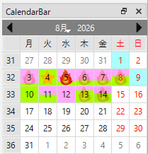
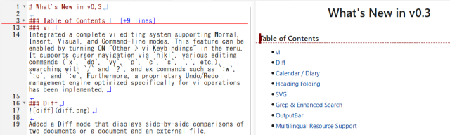
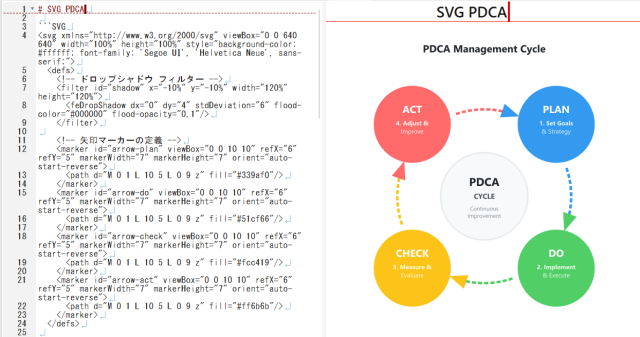

# What's New in v0.3

### Table of Contents
- [vi](#vi)
- [Diff](#diff)
- [Calendar / Diary](#calendar--diary)
- [Heading Folding](#heading-folding)
- [SVG](#svg)
- [Grep & Enhanced Search](#grep--enhanced-search)
- [OutputBar](#outputbar)
- [Multilingual Resource Support](#multilingual-resource-support)

### vi
Integrated a complete vi editing system supporting Normal, Insert, Visual, and Command-line modes. This feature can be enabled by turning ON "Other > vi Keybindings" in the menu. It supports cursor navigation via `hjkl`, various editing commands (`x`, `dd`, `yy`, `p`, `c`, `s`, `.`, etc.), searching with `/` and `?`, and ex commands such as `:w`, `:q`, and `:e`. Furthermore, a proprietary Undo/Redo management engine optimized specifically for vi operations has been implemented.

### Diff

Added a Diff mode that displays side-by-side comparisons of two documents or a document and an external file. Additions, deletions, and modifications are highlighted by background colors on a line-by-line and word-by-word basis, allowing you to merge differences using the `≪` and `≫` buttons. Additionally, a "MiniMap" is included to visually track the overall diff and scroll position.

### Calendar / Diary

Linked with the sidebar calendar, clicking any date automatically generates and opens daily notes or journals (`diary/YYYY/MM/YYYYMMDD.md`) for present, past, or future dates.
The background colors of dates on the calendar are automatically color-coded based on the completion status of ToDos within each diary (incomplete ToDos: light red / all completed: light green / no ToDos: light blue), allowing you to check task progress at a glance.

### Heading Folding

Allows you to fold and unfold text content according to the Markdown heading structure (`#` to `###`).
In addition to clicking the icons (▼ / ▶) next to line numbers, it also supports vi folding commands (`zc`, `zo`, `za`, `zM`, `zR`), significantly improving readability for long-form documents.

### SVG

Renders SVG data written inside `SVG ... ` code blocks in real time using the LunaSVG engine.
Furthermore, an auto-completion dialog triggered by `Ctrl + Space` allows you to easily insert templates for `<svg>` tags and various shape elements (`rect`, `ellipse`, `text`, `path`, etc.).

### Grep & Enhanced Search
Features a Grep search dialog capable of cross-searching files across specified directories.
It supports toggling regular expression search and case-insensitive search (IgnoreCase), alongside quick searches from the toolbar and highlight displays for search results.

### OutputBar
Introduced a new "OutputBar" at the bottom of the screen to display search results and logs.
It can be used for jumping to corresponding lines by double-clicking Grep search results, receiving SVG syntax error notifications, displaying vi automated test results, and referencing cheat sheets.

### Multilingual Resource Support
Supports automatic UI language switching between Japanese and English based on the OS locale settings.
You can change the display language at any time from the Language Settings dialog (applied after restart), allowing menus and dialogs to be fully localized.
