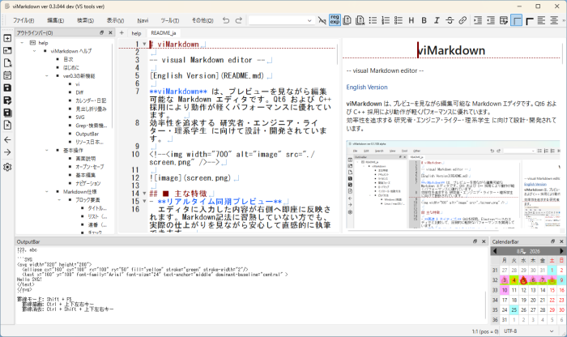

# viMarkdown Help
[日本語 (Japanese)](./ja/help.md)
## Table of Contents
- [Introduction](#Introduction)
- [Basic Operations](#Basic-Operations)
- [Markdown Specifications](#Markdown-Specifications)
  - Block Elements
    - Titles & Headings
    - Lists
    - Checkboxes
    - Ordered Lists
    - Code Blocks
    - Blockquotes
  - Inline Elements
    - Bold
    - Italic
    - Strikethrough
    - Links
    - Images
- [viMarkdown Original Features](#viMarkdown-Original-Features)
  - Box Drawing (Keisen) Blocks
  - CSV Blocks
  - In-Preview Editing
- [FAQ](#FAQ)
- [Appendix](#Appendix) (External Links)
  - Menu List
  - Shortcut Key List

## Introduction
viMarkdown is a Markdown editor with synchronized editor and preview panes, offering lightweight performance and a rich set of unique features.

It supports vi commands for efficient text editing, along with a diff feature for reviewing document changes and a powerful grep feature for string search. Beyond editing in the editor pane, you can also perform basic operations—such as inserting and deleting text, making selections, and cutting and pasting—directly in the preview pane.

In addition to standard GFM tables, viMarkdown supports CSV-formatted tables for smooth data exchange with other applications. It also includes drawing features such as box-drawing (Keisen) blocks and SVG blocks, making it easy to create class diagrams, UI mockups, and more.

This document explains the basic operations of viMarkdown, which offers these distinctive features.
## ■ New Features in ver0.3
### vi
Features a vi editing system (Normal, Insert, Visual, and Command-line modes). Supports cursor navigation with `hjkl`, various editing commands (`x`, `dd`, `yy`, `p`, `c`, `s`, `.`), search using `/` and `?`, and ex commands such as `:w`, `:q`, and `:e`. Additionally, a custom Undo/Redo management engine optimized specifically for vi operations has been implemented.
### Diff
Added Diff mode, allowing side-by-side comparison of differences between two documents, or a document and an external file. Additions, deletions, and modifications are highlighted with background colors at both the line and word levels, and differences can be applied to either document using the `≪` and `≫` buttons. It also features a "MiniMap" to visually monitor overall differences and your current scroll position.
### Calendar & Diary
Integrated with the sidebar calendar, simply clicking any date automatically generates and opens diary files or notes (`diary/YYYY/MM/YYYYMMDD.md`) for present, past, or future dates.
The background of each date on the calendar is automatically color-coded based on the completion status of ToDo items in the diary (Incomplete: Light Red / All Completed: Light Green / No ToDo: Light Blue), allowing you to check task progress at a glance.
### Heading Folding
Allows you to fold and unfold text content according to the Markdown heading structure (`#` to `###`).
In addition to clicking the icons (▼ / ▶) next to line numbers, it supports vi commands (`zc`, `zo`, `za`, `zM`, `zR`), significantly improving readability for long documents.
### SVG
SVG data written inside ```SVG ... ``` code blocks is rendered in real time using the LunaSVG engine.
In addition, an auto-completion dialog triggered by `Ctrl + Space` allows you to easily insert templates for `<svg>` tags and various shape elements (`rect`, `ellipse`, `text`, `path`, etc.).
### Grep & Search Enhancements
Equipped with a Grep search dialog for searching across files within a specified directory.
It supports regular expression search and case-insensitive search (IgnoreCase) toggling, as well as quick searching from the toolbar and search result highlighting.
### OutputBar
Added the "OutputBar" at the bottom of the screen to display search results and logs.
It can be used to jump to corresponding lines by double-clicking Grep search results, view SVG syntax error notifications, check vi automated test results, reference cheat sheets, and more.
### Localization & Resource Support
Supports automatic switching between Japanese and English UIs based on OS language settings (Locale).
The display language can be changed at any time from the Language Dialog (takes effect after restarting), allowing all menus and dialogs to be fully localized.

## Basic Operations
### UI Overview


- (1) Title Bar
  Application name, Minimize / Maximize / Close buttons
- (2) Menu Bar & Toolbar
  Execute various actions via mouse clicks, access keys, or keyboard shortcuts.
- (3) Outline Bar
  - List of currently open documents
  - Heading tree of the document; click to jump directly to the target heading.
- (4) Document Tabs
  Switch between multiple documents using tabs.
  - Editor (Left Pane)
    Edit your Markdown source text.
  - Preview (Right Pane)
    Displays the formatted Markdown layout.
    - Checkboxes: Toggle state with a single mouse click.
    - Direct editing (inserting/deleting text) is also supported.
- (5) Output Bar
  Displays status messages, Grep search results, SVG / custom block outputs, and input guides (such as keybindings for Ruled Line mode).
- (6) Calendar Bar
  Displays a monthly calendar.  
  Click a date to create or open that day's daily note, and visually track ToDo task progress.
- (7) Status Bar
  Displays notifications/messages, cursor position, and character encoding.
## Markdown Syntax Specifications
### Block Elements
Defines structural elements on a line-by-line basis, such as headings and lists.

#### Headings
Creates document titles and section headings.  
Place a hash symbol `#` followed by a space at the beginning of a line.  
The number of `#` symbols (1 to 6) determines the heading level and text size.

Example:
```markdown
# Document Title
## Heading 1
### Heading 2
#### Heading 3
```

#### Unordered Lists (Bullet Lists)
Creates a bulleted list.  
Start the line with a hyphen `-`, plus `+`, or asterisk `*`, followed by a space.

Example:
```markdown
- Apple
- Orange
```
Result:
- Apple
- Orange

#### Ordered Lists (Numbered Lists)
Creates a sequential list. Start the line with a number and a period (`1.`), followed by a space.  
*(Note: Even if you write `1.` for all items, they will automatically be numbered sequentially when displayed.)*

Example:
```markdown
1. First step
1. Next step
```
Result:
1. First step
2. Next step

#### Task Lists (Checkboxes)
Creates a ToDo list by placing `[ ]` (space inside) or `[x]` immediately after the list marker.

Example:
```markdown
- [ ] Incomplete task
- [x] Completed task
```
Result:
- [ ] Incomplete task
- [x] Completed task

#### Blockquotes
Indicates that the text is quoted from another source. Place a greater-than symbol `>` followed by a space at the beginning of the line.

Example:
```markdown
> To be, or not to be,
> that is the question.
```
Result:
> To be, or not to be,
> that is the question.

#### Code Blocks
Used to display source code or preformatted text.  
Enclose the target text between lines consisting only of three backticks ( ` ``` ` ). Specifying a language name (e.g., `cpp` or `python`) right after the opening backticks enables syntax highlighting.

Example:
````markdown
```cpp
int main() {
    return 0;
}
```
````

---

### Inline Elements
Formats specific text within a sentence, or inserts links and images.  
These can be included inside block elements.

**💡 Helpful Tip**  
In addition to typing symbols manually, you can easily apply formatting by **selecting text and clicking toolbar icons or navigating to the menu (`Edit` > `Inline`)**.

#### Bold
Surround the text with two asterisks (`**`) or two underscores (`__`). Used to emphasize text.
- Menu: `Edit` > `Inline` > `Bold`
- Example: `This is **bold** text.`
- Result: This is **bold** text.

#### Italic
Surround the text with a single asterisk (`*`) or underscore (`_`). Displays text in italics.
- Menu: `Edit` > `Inline` > `Italic`
- Example: `This is *italic* text.`
- Result: This is *italic* text.

#### Strikethrough
Surround the text with two tildes (`~~`). Draws a horizontal line through the center of the text.
- Menu: `Edit` > `Inline` > `Strikethrough`
- Example: `This is ~~strikethrough~~ text.`
- Result: This is ~~strikethrough~~ text.

#### Inline Code
Used to display code snippets or specific symbols literally. Surround the text with backticks ( `` ` `` ).  
Markdown formatting characters (like `**` or `~~`) inside inline code will not be styled and will appear as raw text.
- Example: `` `**raw bold syntax**` ``
- Result: `**raw bold syntax**`

#### Links
Creates a hyperlink using the syntax `[Link Text](URL)`.
- Example: `For details, visit [Google](https://google.com).`
- Result: For details, visit [Google](https://google.com).

#### Images
Embeds an image into the document by adding an exclamation mark `!` before the link syntax: ``.
- Example: ``
## viMarkdown Original Features
## FAQ
## Appendix
