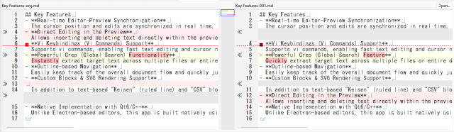
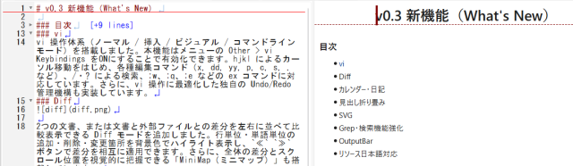

# v0.3 新機能（What's New）

### 目次
- [vi](#vi)
- Diff
- カレンダー・日記
- 見出し折り畳み
- SVG
- Grep・検索機能強化
- OutputBar
- リソース日本語対応

### vi
vi 操作体系（ノーマル / 挿入 / ビジュアル / コマンドラインモード）を搭載しました。本機能はメニューの Other > vi Keybindings をONにすることで有効化できます。hjkl によるカーソル移動をはじめ、各種編集コマンド（x, dd, yy, p, c, s, . など）、/・? による検索、:w、:q、:e などの ex コマンドに対応しています。さらに、vi 操作に最適化した独自の Undo/Redo 管理機構も実装しています。
### Diff

2つの文書、または文書と外部ファイルとの差分を左右に並べて比較表示できる Diff モードを追加しました。行単位・単語単位の追加・削除・変更箇所を背景色でハイライト表示し、`≪` `≫` ボタンで差分を相互に適用できます。さらに、全体の差分とスクロール位置を視覚的に把握できる「MiniMap（ミニマップ）」も搭載しています。
### カレンダー・日記

カレンダーバーのカレンダーと連動し、日付をクリックするだけで当日・過去・未来の日記やノート（`diary/YYYY/MM/YYYYMMDD.md`）を自動生成して開きます。
日記内の ToDo の達成状況に応じて、カレンダーの日付背景を自動的に色分け表示します（未完了あり：薄赤 / 全完了：薄緑 / ToDoなし：薄青）。タスクの進捗状況をひと目で確認できます。
### 見出し折り畳み

Markdown の見出し構造（`#`〜`###`）に応じて本文を折り畳み・展開できるようになりました。
行番号横のアイコン（▼ / ▶）のクリックに加え、vi コマンド（`zc`、`zo`、`za`、`zM`、`zR`）にも対応しており、長文ドキュメントの閲覧性を向上します。
### SVG

`SVG ... ` コードブロックに記述した SVG データを、LunaSVG エンジンによってリアルタイムにレンダリングします。
また、`Ctrl + Space` で起動する補完ダイアログから、`<svg>` タグや各種図形要素（`rect`、`ellipse`、`text`、`path` など）のテンプレートを簡単に挿入できます。
### Grep・検索機能強化
指定したディレクトリ内のファイルを対象に横断検索できる Grep 検索ダイアログを搭載しました。
正規表現検索や大文字・小文字を区別しない検索（IgnoreCase）の切り替えに対応したほか、ツールバーからの高速検索や検索結果のハイライト表示もサポートしています。
### OutputBar
画面下部に検索結果やログを表示する「OutputBar」を新設しました。
Grep 検索結果のダブルクリックによる該当行へのジャンプ、SVG の構文エラー通知、vi 自動テスト結果の表示、チートシートの参照などに活用できます。
### リソース日本語対応
OS の言語設定（Locale）に応じた日本語 / 英語 UI の自動切り替えに対応しました。
言語設定ダイアログから表示言語をいつでも変更でき（再起動後に反映）、各種メニューやダイアログをローカライズして利用できます。