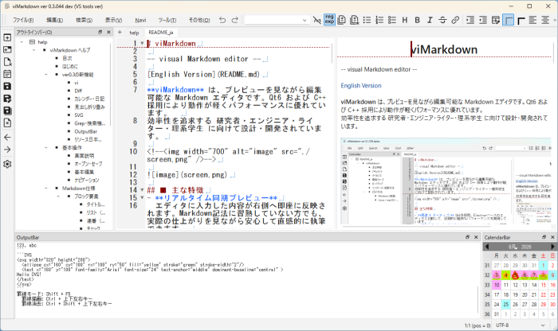

# viMarkdown ヘルプ
[English](../help.md)

## ■ 目次
- [はじめに](#はじめに)
- [ver 0.3 の新機能](#ver0.3の新機能)
- [基本操作](#基本操作)
  - [画面説明](#画面説明)
  - [オープン・セーブ](#オープン・セーブ)
  - [基本編集](#基本編集)
  - [ナビゲーション](#ナビゲーション)
- [Markdown仕様](#Markdown仕様)
- [viMarkdown独自仕様](#viMarkdown独自仕様)
  - [罫線ブロック](#罫線ブロック)
  - [CSVブロック](#CSVブロック)
  - [プレビュー内編集](#プレビュー内編集)
- [FAQ](#FAQ)
- [付録](#付録)
  - [免責事項](#免責事項)

## ■ はじめに
viMarkdownは、エディタとプレビューが連動する、軽快な動作と豊富な独自機能を備えたMarkdownエディタです。
効率的なテキスト操作を可能にするviコマンドに対応しているほか、文書の変更点を確認できるdiff機能、強力な文字列検索を行えるgrep機能も搭載しています。また、エディタ側での編集にとどまらず、プレビュー画面上でも文字の挿入・削除、選択、カット＆ペーストといった基本操作を直接行うことができます。
さらに、通常の表組み（GFM）に加え、他アプリケーションとのデータ連携をスムーズにするCSV形式の表もサポート。クラス図やUIモックアップなどを手軽に作図できる罫線ブロックやSVGブロックといった描画機能も備えています。

本稿では、こうした特徴を持つviMarkdownの基本的な操作方法について解説します。

## ■ ver0.3の新機能
### vi
vi 操作体系（ノーマル / 挿入 / ビジュアル / コマンドラインモード）を搭載しました。`hjkl` によるカーソル移動をはじめ、各種編集コマンド（`x`, `dd`, `yy`, `p`, `c`, `s`, `.` など）、`/`・`?` による検索、`:w`、`:q`、`:e` などの ex コマンドに対応しています。さらに、vi 操作に最適化した独自の Undo/Redo 管理機構も実装しています。
### Diff
2つの文書、または文書と外部ファイルとの差分を左右に並べて比較表示できる Diff モードを追加しました。行単位・単語単位の追加・削除・変更箇所を背景色でハイライト表示し、`≪` `≫` ボタンで差分を相互に適用できます。さらに、全体の差分とスクロール位置を視覚的に把握できる「MiniMap（ミニマップ）」も搭載しています。
### カレンダー・日記
サイドバーのカレンダーと連動し、日付をクリックするだけで当日・過去・未来の日記やノート（`diary/YYYY/MM/YYYYMMDD.md`）を自動生成して開きます。
日記内の ToDo の達成状況に応じて、カレンダーの日付背景を自動的に色分け表示します（未完了あり：薄赤 / 全完了：薄緑 / ToDoなし：薄青）。タスクの進捗状況をひと目で確認できます。
### 見出し折り畳み
Markdown の見出し構造（`#`〜`###`）に応じて本文を折り畳み・展開できるようになりました。
行番号横のアイコン（▼ / ▶）のクリックに加え、vi コマンド（`zc`、`zo`、`za`、`zM`、`zR`）にも対応しており、長文ドキュメントの閲覧性を向上します。
### SVG
`SVG ... ` コードブロックに記述した SVG データを、LunaSVG エンジンによってリアルタイムにレンダリングします。
また、`Ctrl + Space` で起動する補完ダイアログから、`<svg>` タグや各種図形要素（`rect`、`ellipse`、`text`、`path` など）のテンプレートを簡単に挿入できます。
### Grep・検索機能強化
指定したディレクトリ内のファイルを対象に横断検索できる Grep 検索ダイアログを搭載しました。
正規表現検索や大文字・小文字を区別しない検索（IgnoreCase）の切り替えに対応したほか、ツールバーからの高速検索や検索結果のハイライト表示もサポートしています。
### OutputBar
画面下部に検索結果やログを表示する「OutputBar」を新設しました。
Grep 検索結果のダブルクリックによる該当行へのジャンプ、SVG の構文エラー通知、vi 自動テスト結果の表示、チートシートの参照などに活用できます。
### リソース日本語対応
OS の言語設定（Locale）に応じた日本語 / 英語 UI の自動切り替えに対応しました。
言語設定ダイアログから表示言語をいつでも変更でき（再起動後に反映）、各種メニューやダイアログをローカライズして利用できます。
## ■ 基本操作
### 画面説明


- ① タイトルバー
  アプリ名、最小化・最大化・終了ボタン
- ② メニュー・ツールバー
  マウスクリック・アクセスキー・ショートカットにより各種アクションを実行可能
- ③ アウトラインバー
  オープンしている文書一覧  
  文書内見出しツリー、クリックにより当該見出しにジャンプ
- ④ タブ
  複数の文書をタブで切り替えて表示
  - エディタ（左側）
    マークダウン文書を編集
  - プレビュー（右側）
    レイアウトされたマークダウンを表示
    チェックボックス：マウスクリックで状態反転
    簡単な編集（文字挿入・削除）も可能
- ⑤ ステータスバー
  メッセージ表示、カーソル位置、文字エンコーディング表示
### オープン・セーブ
- 通常オープン
  ファイル > オープン (Ctrl + O) メニュー、またはツールバーの Open をクリックします。  
  ファイルオープンダイアログが表示されるので、開く md ファイルを選択します。
- 最近のファイル
  ファイル > 最近のファイル から、最近開いたファイルの一覧を表示します。  
  一覧からファイルを選択すると、そのファイルがオープンされます。
- お気に入りのファイル
  ファイル > お気に入りのファイル から、登録したファイルの一覧を表示します。  
  一覧からファイルを選択すると、そのファイルがオープンされます。  
  ファイル > お気に入りのファイル > 現文書追加 で、
  現在編集中の文書がお気に入りのファイルリストに追加されます。
- セーブ
  ファイル > 保存 (Ctrl + S) で現在の文書を上書き保存します。
- 別名保存
  名前をつけて保存 (Save As) では、新しいファイル名で保存できます。

※ 未保存の文書には、タブのタイトル末尾に * が表示されます。  
保存状況を確認する際の目印としてご活用ください。

### 基本編集
一般的なテキストエディタ同様に文章を編集可能
  - 文字入力・削除
    入力した文字列はそのまま挿入される。
    Delete: カーソル位置文字削除
    BackSpace: カーソル直前位置文字削除
  - カーソル移動、文字列選択
    上下左右矢印キーでその方向にカーソル移動
    Shift を押しながらカーソル移動: 文字列選択
    マウスダブルクリック: 単語単位選択
  - Cut/Copy/Paste
    文字列を選択し Edit > Cut (Ctrl + X): 選択文字列をクリップボードにコピーし、削除
    文字列を選択し Edit > Copy (Ctrl + C): 選択文字列をクリップボードにコピー
    Edit > Paste (Ctrl + V): クリップボード内文字列をカーソル位置に挿入
  - Undo/Redo
    Edit > Undo (Ctrl + Z): 直前編集操作を取り消し
    Edit > Redo (Ctrl + Y): 直前編集操作を繰り返し
### ナビゲーション
  - アウトラインバー
  - 文書履歴
  - 直前文書切り替え

## ■ Markdown仕様
### ブロック要素
見出しやリストなど、行単位で要素を指定します。
#### **タイトル・見出し**
文書のタイトルや各章の見出しを作成します。
行頭にハッシュ記号 `#` と半角スペースを入れます。
「`#`」の数（1〜6個）によって階層と文字の大きさが変わります。
入力例:
　`# 文章タイトル`
　`## 大見出し`
　`### 中見出し`
　`#### 小見出し`
#### **リスト（箇条書き）**
  順序のない箇条書きを作成します。
  行頭にハイフン `-` 、プラス `+` 、アスタリスク `*` のいずれかと、半角スペースを入れます。
入力例:
　`- りんご`
　`- みかん`
結果:
    - りんご
    - みかん
#### **連番（番号付きリスト）**
  順序のある箇条書きを作成します。行頭に「数字とピリオド `1.`」と、半角スペースを入れます。
入力例:
　`1. 最初のステップ`
　`1. 次のステップ`
結果:
1. 最初のステップ
1. 次のステップ
#### **チェックボックス（タスクリスト）**
  リストの記法の直後に `[ ]`（空白）または `[x]`（小文字のエックス）を入れることで、ToDoリストを作成できます。
入力例:
　`- [ ] 未完了のタスク`
　`- [x] 完了したタスク`
結果:
  - [ ] 未完了のタスク
  - [x] 完了したタスク
#### **引用**
  他の文章からの引用であることを示します。行頭に大なり記号 `>` と半角スペースを入れます。
入力例:
　`> 吾輩は猫である。`
　`> 名前はまだ無い。`
結果:
> 吾輩は猫である。
> 名前はまだ無い。
#### **コードブロック**
  プログラムのソースコードなどをそのまま表示したい場合に使用します。
  バッククォート3つ（ ` ``` ` ）だけの行で、表示したいテキストの上下を囲みます。最初の ` ``` ` の後に言語名（例: `cpp` や `python`）を書くことで、色付け（シンタックスハイライト）される場合があります。
入力例:
　` ``` `
　`    int main() {`
　`        return 0;`
　`    }`
　 ` ``` `
### インライン要素
文中の文字の一部を装飾したり、リンクや画像を挿入したりする記法です。
ブロック要素の中に含めることが可能です。

**💡 便利な入力方法**
記号を直接キーボードから入力するだけでなく、**テキストを選択した状態でメニュー（`Edit` > `Inline`）や、ツールバーのアイコンをクリック**することでも、簡単に装飾を適用することができます。
#### **ボールド（太字）**
  アスタリスク2つ（`**`）、またはアンダースコア2つ（`__`）で文字列を囲みます。
  文字を強調したい場合に使用します。
  - メニュー: `Edit` > `Inline` > `Bold`
  - 入力例: `これは **太字** です`
  - 結果: これは **太字** です
#### **イタリック（斜体）**
  アスタリスク1つ（`*`）、またはアンダースコア1つ（`_`）で文字列を囲みます。
  文字を斜めに傾けて表示します。
  - メニュー: `Edit` > `Inline` > `Italic`
  - 入力例: `これは *斜体* です`
  - 結果: これは *斜体* です
#### **打ち消し線**
  チルダ2つ（`~~`）で文字列を囲みます。
  文字の中央に取り消し線を引きます。
  - メニュー: `Edit` > `Inline` > `Strikethrough`
  - 入力例: `これは ~~打ち消し線~~ です`
  - 結果: これは ~~打ち消し線~~ です
#### **インラインコード**
  プログラムのコードや、特定の記号をそのまま表示したい場合に使用します。文字列をバッククォート `` ` `` で囲みます。
  この記法で囲まれた中にあるMarkdown記号（`**` や `~~` など）は装飾されず、そのまま表示されます。
  - 入力例: `` `**太字**` ``
  - 結果: `**太字**`
#### **リンク**
  [表示したいテキスト] の直後に (URL) を記述します。
  Webページなどへのハイパーリンクを作成します。
  URLだけを記述する（オートリンク）ことも可能です。
  - 入力例: `詳しくは [Google](https://google.com) をご覧ください`
  - 結果: 詳しくは [Google](https://google.com) をご覧ください
#### **画像**
  リンクの記法の先頭に `!`（エクスクラメーションマーク）を付けます。
  ![代替テキスト（画像が表示されない時の文字）] の直後に (画像のパスまたはURL) を記述します。
  文書内に画像を埋め込みます。
  - 入力例: ``

## ■ viMarkdown独自仕様
### カレンダー・日記
CalendarBar（カレンダーバー）から日付を選ぶだけで、日々の記録・日報・デイリーノートを素早く作成・参照・編集できる機能です。
- **日付ワンクリックで日記を作成・参照**
  - CalendarBar 上の対象日をクリックするだけで、該当する日付のノート（`YYYYMMDD`）を瞬時にオープン
  - ファイルが存在しない場合は、日付見出しやセクション（`Todo`, `Notes` など）を含むテンプレートから自動作成
- **記録状況のカラーハイライト表示**
  - 日記・ノートが存在する日付はカレンダー上で色付きでハイライト表示され、日々の記録状況や進捗が一目で判別可能
- **ドッキングウィンドウによる柔軟な配置**
  - CalendarBar は画面下部や左右など、好みの位置にドッキング／フローティング配置が可能
  - サイドバーのアイコンやメニューからいつでも表示／非表示を切り替え
- **アウトラインバーとのシームレスな連動**
  - 開いた日付ノートの見出し構造（`Todo`, 各プロジェクト項目など）が左側のアウトラインバーに即座に反映され、目的のタスクへすばやくジャンプ
- **週番号表示＆スムーズな月移動**
  - カレンダー左端に週番号（Week Number）を表示
  - 左右の矢印ボタン（◀ / ▶）で過去・未来の月へ簡単に切り替えて記録を振り返り・計画可能
### SVG ブロック
SVGブロックとは、Markdown内にベクターグラフィック（SVG）コードを直接記述し、プレビュー上で図形やイラストを描画できる機能です。
「\```svg」「\```」の間にSVGタグを記述するだけで、外部画像ファイルを用意することなくインラインで図を表示できます。

> <svg width="120" height="60" viewBox="0 0 120 60">
>   <rect x="5" y="5" width="110" height="50" rx="10" fill="#e1f5fe" stroke="#0288d1" stroke-width="2"/>
>   <text x="60" y="35" font-size="14" text-anchor="middle" fill="#01579b">SVG Block</text>
> </svg>

```SVG
<svg width="120" height="60" viewBox="0 0 120 60">
  <rect x="5" y="5" width="110" height="50" rx="10" fill="#e1f5fe" stroke="#0288d1" stroke-width="2"/>
  <text x="60" y="35" font-size="14" text-anchor="middle" fill="#01579b">SVG Block</text>
</svg>
```

- \`\`\`svg ～ \`\`\` で囲むことで、SVGマークアップを直接記述・プレビュー表示可能
- 外部画像ファイル（.svg/.png等）を配置・管理する手間なく、Markdownファイル単体で図を完結
- ベクター形式のため、拡大・縮小しても解像度を損なわずに美しく表示
- コードブロックヘッダで背景色などのスタイル属性を指定可能（例: ```` ```svg background-color: #f0f0f0; ````）
- テキストベースの図記述のため、Gitなどのバージョン管理システムで差分（Diff）の追跡が容易
- XMLタグ（`<rect>`, `<circle>`, `<path>`, `<text>` など）やインラインCSSスタイルの記述に完全対応

### 罫線ブロック
- 罫線文字を使用し、下図のようなクラス図・UIモックアップ等を容易に作図可能
```keisen background-color: #f0f0f0;
    ┏━━━━━━┓        ┌──────┐
    ┃    User    ┃───→│    Data    │
    ┗━━━━━━┛        └──────┘
```
- Tool > KeisenMode (Shift + F5)：罫線モード ON/OFF
- 罫線モード：Ctrl + 上下左右矢印キー で罫線描画
- 罫線モード：Ctrl Shift + 上下左右矢印キー で罫線消去
- Tool > ThinKeisen：細罫線
- Tool > ThickKeisen：太罫線
- 編集位置右に罫線がある場合、罫線位置を維持（罫線保護機能）
```keisen background-color: #f0f0f0;
    ┏━━━━━━┓
    ┃            ┃
    ┗━━━━━━┛
           │
           │枠内に文字入力しても
           │右側罫線がずれない（罫線保護）
           ↓
    ┏━━━━━━┓
    ┃abcあ       ┃
    ┗━━━━━━┛
```
- 罫線枠内でテキストを左右寄せ・センタリング
```keisen background-color: #f0f0f0;
    ┏━━━━━━┓
    ┃abcあ       ┃
    ┗━━━━━━┛
           │
           │右寄せ (Edit > Format > AlignRight)
           ↓
    ┏━━━━━━┓
    ┃       abcあ┃
    ┗━━━━━━┛
```
- Tool > OpenPrev (Shift + F7)：カーソル行の上に罫線を接続した行作成
- Tool > OpenNext (F7)：カーソル行の下に罫線を接続した行作成
```keisen background-color: #f0f0f0;
    ┏━━━━━━━━┓
    ┃  MarkdownEdit  ┃
    ┠────────┨← この行にカーソルがある場合
    ┠────────┨
    ┗━━━━━━━━┛
           │
           │Tool > OpenNext (F7)
           ↓
    ┏━━━━━━━━┓
    ┃  MarkdownEdit  ┃
    ┠────────┨
    ┃                ┃← 罫線を考慮した行が作成される
    ┠────────┨
    ┗━━━━━━━━┛
```
### CSVブロック

CSVブロックとは、Markdownの中に、表計算ライクな表データを簡単に記述できる機能です。  
「\```CSV」「\```」の２行を記述し、その間にカンマ区切りでデータを入力するだけで、プレビュー上で美しい表に変換されます。

> ```CSV
> 氏名,年齢,部署
> 田中太郎,30,営業
> 佐藤花子,25,開発
> ```
　　↓

```CSV
氏名,年齢,部署
田中太郎,30,営業
佐藤花子,25,開発
```

- データの１行目はヘッダ（見出し行）になる
- ヘッダ・データ本体は１行おき（ゼブラカラー）に背景強調される
ヘッダ・ゼブラカラーは設定ダイアログで指定可能
- 「数値」や「%」は自動的に右寄せで表示されます。
- セル内でカンマ , を表示したい場合は、\, とエスケープ
または「ダブルクォーテーション "" で囲むとカンマを含められる
- セル内で太字（**）や斜体（*）などのMarkdown記法が使えます。
- 前後の空白（スペース）は自動的に無視（トリム）されます。
- CSVブロックにカーソルがある状態で、Edit > Convert > CSV -> MarkdownTable メニューを実行することで、GFM形式の表に変換可能

※ 2.x では、プレビューからもCSV本体の改行、カンマの削除によるセル結合、カンマの挿入によるセル分割が可能です。
この仕様は 4.x で変更されるかもしれません。

### プレビュー内編集

プレビュー画面をそのまま編集できる機能（Live Editing）です。  
テキストをクリックしフォーカスを設定するだけで、エディタに戻らず直接編集できます。

- 基本操作
  - プレビュー上のテキストをクリックして、そのまま編集可能
  - エディタとプレビューを頻繁に切り替える必要はありません
- エディタとの同期
  - プレビューでの編集内容は、Markdownソースに即座に反映されます
  - どちらの画面で編集しても、カーソル位置や状態は常に同期されます
- チェックボックス操作
  - プレビューの '☐' 部分をクリックするだけで `[x]` に切り替え可能
  - マウス操作だけでタスク管理ができます
- 入力補助
  - ショートカット操作（ボールド、イタリック、リスト、見出しなど）に対応
  - プレビューを見たまま直感的に編集できます


## FAQ
```CSV
, Questions & Answers
**Q.**, 罫線モード（Shift + F5）で、描いた線が勝手に繋がったり形が変わったりした。  
**A.**, viMarkdownは、上下左右の接続状況を自動判定して最適な罫線文字を選択する「自動結合機能」を備えています。意図しない結合を防ぎたい場合は、周囲に半角スペースを置くか、**Ctrl + Shift + 矢印キー** で不要な部分を消去して調整してください。
**Q.**, 罫線枠内で文字を打っても、枠が右にズレないのはなぜ？  
**A.**, 「罫線保護機能」が働いているためです。枠内で文字を挿入・削除しても、右側にある垂直罫線の位置を維持しようとします。これにより、クラス図やUIモックアップ図のレイアウトを崩さずにテキスト編集が可能です。
**Q.**, CSVブロックを通常のMarkdownテーブルに変換するには？  
**A.**, 対象のCSV ブロック内にカーソルを置き、メニューの **Edit > Convert > CSV -> Markdown Table** を実行してください。逆に通常のテーブルをCSVブロックに変換して管理することも可能です。
**Q.**, エディタでスクロール表示した場所がプレビューで表示されない。  
**A.**, エディタとプレビューは**カーソル位置で同期**しています。エディタでカーソルを移動（または文字入力）すると、プレビュー側も該当する見出しや本文が画面内に収まるよう自動スクロールします。同期を切り替えたい場合は V**iew > Toggle Focus (Ctrl + \)** を活用してください。
**Q.**, 複数の文書を行き来していたら、さっきまで編集していた場所がわからなくなった。  
**A.**, ブラウザのように **Alt + ← (戻る) と Alt + → (進む)** が使えます。これはファイル間の移動だけでなく、同じ文書内での「リンクジャンプ」後の復帰にも対応しており、カーソル位置も含めて復元されます。
**Q.**, 検索ハイライト（黄色）を消したい。  
**A.**, 検索ハイライトを消したい場合は、**Alt + F3 (検索強調クリア)** を押してください。
**Q.**, viのような操作ができると聞きましたが、どのコマンドに対応してる？  
**A.**, ver 0.3 より **基本 vi キーバインド（vi コマンド）に対応しました**。メニューの「その他 > vi Keybindings」を有効にすることで、基本移動（hjkl、w、b、gg、G 等）や編集（i、a、o、d、c、y、p、r 等）、検索（/、?、n）、exコマンド（:w、:q、:s 等）、見出し折り畳み（za、zM 等）など多数のコマンドをご利用いただけます。対応コマンドの詳細はメニューの「その他 > チートシート > Vi」から確認できます。
**Q.**, 非常に長い（数万行以上の）文書を編集すると動作が重くなった。  
**A.**, 現在（ver 0.2以下）は**インクリメンタルパースを行っていない**ため、巨大なファイルのレンダリングには時間がかかる場合があります。**千行程度を目安に、ファイルを分割**して管理することをお勧めします。分割したファイル同士は \[タイトル\](ファイル名.md) でリンクさせれば、スムーズに行き来可能です。
```

## 付録
### 免責事項
本ソフトウェア（viMarkdown）は「現状有姿（AS IS）」で提供され、明示・黙示を問わず、その正確性、完全性、特定目的への適合性についていかなる保証も行いません。

本ソフトウェアの使用または使用不能によって生じたいかなる損害（データの消失、業務の中断、金銭的損失などを含みますが、これらに限定されません）について、作者は一切の責任を負いません。重要なファイルは定期的にバックアップを取った上でご利用ください。
### その他
  - [メニュー一覧](menu.md)
  - [ダイアログ一覧](dialogs.md)
  - ショートカット一覧
