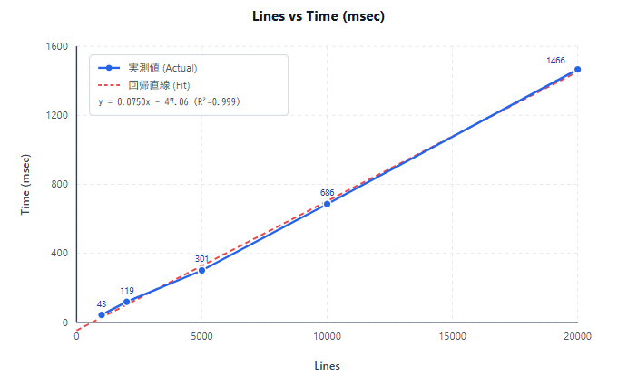

# 2026-08-22 (Sat)

## Todo
### Benchmark
- [x] 1000, 2000, 5000, 10000, 20000 行生成（US_HEADING)
- [ ] リッチテキスト変換：ブロック単位にし、US\_HEADING 設定
- [ ] 編集位置見出し行検索

## Notes
### 見出しブロック単位の部分再変換
- 実験文書：（見出し行＋本文＊２４行）＊Ｎ
- 方針：とりあえず、見出し行単位でプレビューを更新する
  - \<!\-\- コメントアウト、コードブロックは当面考慮しない
- とりあえず特別な高速化は行わない
  - 編集位置から前方に見出し行探索：距離が短いので実質 O(1)
  - エディタ見出し行に対応するプレビュー見出し行をシーケンシャル探索
    - O(N) だが、処理が非常に軽いので実質無視できる？
  - エディタ：次の見出し行直前までのテキスト取得
  - プレビュー：次の見出し行直前までを削除し、insertMarkdown()
  - ※ 見出し行は block.userState() が US\_HEADING の値を持ち、本文と区別可能

```csv
Lines, Time(msec)
1000, 43
2000, 119
5000, 301
10000, 686
20000, 1466
```



