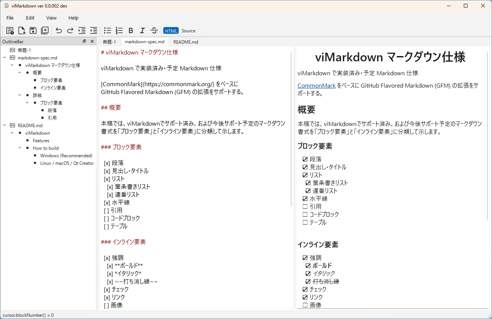

# viMarkdown-quickstart.md

## 概要

- viMarkdown とは
- 何ができて、何ができないか
- ターゲットユーザ
- 動作環境

## 簡単な入門 目次

- 画面説明
  - エディタ領域
  - プレビュー画面
  - アウトラインバー
  - メニュー、ツールバー
  - ステータスバー
- マークダウンで文章を書いてみる
  - エディタでの編集はリアルタイムにプレビュー画面に反映される
  - 見出し
  - 本文
  - リスト
  - 文字強調
- ファイル保存
- 既存のマークダウンファイルを開く
  - Recent Files
- 文書クローズ
- アプリ終了

## 簡単な入門

viMarkdownのインターフェースは、左側に構造把握のための「アウトライン」、中央に「エディタ」、右側に「プレビュー」を配置した、直感的で効率的な3カラム構成を採用しています。

### アウトラインバー（左ペイン）

執筆中の文書構造をツリー形式で表示します。

- **見出し抽出:** 文書内の #（H1）や ##（H2）といった見出しを自動的に解析し、階層構造で表示します。
- **ファイル一覧:** 現在開いている複数のファイルをフォルダ形式で管理し、素早く切り替えることができます。
- **クイックジャンプ:** ツリー内の項目をクリックすることで、エディタおよびプレビューを該当箇所へ瞬時に移動させることが可能です。

### エディタ領域（中央ペイン）

マークダウンを記述するメインの作業エリアです。

- **タブインターフェース:** 複数の文書を同時に開き、上部のタブで切り替えながら並行して執筆できます。
- **シンタックスハイライト:** 見出しが赤色で強調されるなど、マークダウン記法がリアルタイムで色付けされ、プレーンテキストよりも構造が把握しやすくなっています。
- **編集操作:** 通常のテキストエディタと同様の直感的な入力・修正が可能です（※viコマンド機能は今後のバージョンで実装予定）。

### プレビュー画面（右ペイン）

エディタで入力したマークダウンが、最終的にどのような外見になるかをリアルタイムに表示します。

- **ビジュアル確認:** 太字、リスト、見出し、テーブルなどがHTMLとしてレンダリングされます。
- **仕上がりチェック:** 執筆しながら、改行の具合や構造のミスを視覚的に確認できます。
- **HTMLソース表示:** ツールバーの [Source] ボタンを選択することで、レンダリングされた HTMLソースコードを表示 することができます。生成されたコードをコピーして、他のWebサイトやブログへ貼り付けて利用するといった用途にも活用可能です。

### メニュー・ツールバー（上部）

主要な機能に素早くアクセスするためのエリアです。

- **標準メニュー:** ファイル操作（保存、開く）、編集（元に戻す、やり直し）、検索などの標準的な機能を備えています。
- **書式ボタン:** 太字(B)、斜体(I)、打ち消し線(S)といった頻繁に使用するマークダウン記法を、選択範囲に対してワンクリックで適用できます。
- **表示切り替え:** 「HTML」表示と「Source（ソースコード）」表示を切り替えるボタンにより、レンダリング結果の詳細を確認することが可能です。

### ステータスバー（下部）

現在の編集状態をリアルタイムで表示します。

- **カーソル位置:** 右端に「行：列」の形式（例：12:7）で現在のカーソル位置を表示します。
- **情報通知:** アプリの状態やメッセージが表示されます。
